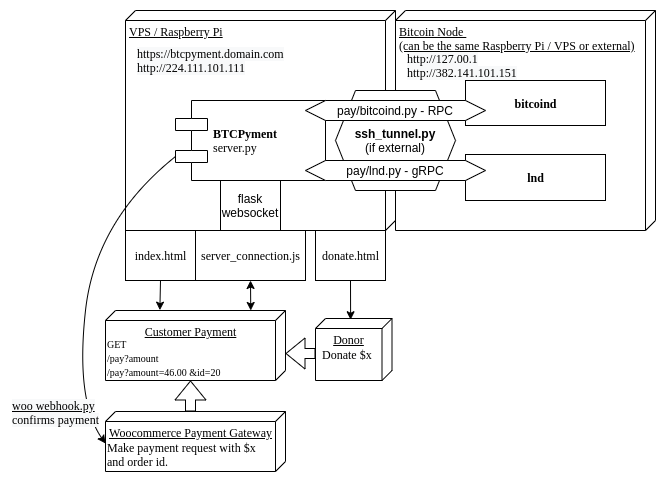

# SatSale

SatSale is a lightweight Bitcoin payment processor with the option of connecting to your own Bitcoin node or Lightning network node.

|                                                                                                Donation Button ----->                                                                                                 |                                                                                       Bitcoin Payment Gateway                                                                                        |
| :-------------------------------------------------------------------------------------------------------------------------------------------------------------------------------------------------------------------: | :--------------------------------------------------------------------------------------------------------------------------------------------------------------------------------------------------: |
| [](https://try.satsale.org/) <br />(Click for donation page demo)<br /> Initiates payment -----> | [](https://store.btcpyment.com/) <br />(Click for WordPress store payments demo) |

- [Features](#features)
- [Installation (short!)](#installation--short--)
  - [Install](#install)
  - [Run SatSale](#run-satsale)
  - [Embed a Donation Button](#embed-a-donation-button)
  - [Using HTTPS & Domains](#using-https---domains)
  - [Lightning Address](#lightning-address)
  - [Security](#security)
  - [Payment Gateway (Woocommerce)](#payment-gateway--woocommerce-)
- [Updating](#Updating)
- [Docs](#Docs)
- [Contributions welcomed](#contributions-welcomed)
- [Disclaimer](#disclaimer)
- [Support](#support)


Satsale can be used as a

1. Donation page and button for your website that you can easily embed/link to anywhere.
2. Bitcoin payment gateway, including a Woocommerce plugin that easily turns any Wordpress site into a Bitcoin accepting store.
3. Versatile API and payments platform for both on-chain and lightning payments (supporting both clightning and lnd).

Compared to other Bitcoin payment processors, SatSale is lightweight, easy to install and self-host. SatSale is also a great building block for python lightning applications.

SatSale makes donation buttons simple - an easy copy and paste of the one line HTML iframe into your site.

SatSale can talk to your own Bitcoin node, and **verify payments with your own copy of the blockchain**. Payments go **directly into your wallet with no third party**.

# Features

- Connect SatSale to your node, or you can rely on someone else's with just your extended public key.
- Supports both clightning and lnd, or you can just use on-chain!
- Direct peer-to-peer payments without any middleman. No KYC, and greater privacy than donation systems where Bitcoin addresses are reused multiple times.
- [Lightning Address](https://lightningaddress.com) support (e.g. me@mydomain.com)
- **Lightweight and highly extendable**, with basic html and css styling and a modular Python backend. Take a [look at the code](satsale.py) or [lnd.py](/node/lnd.py)!
- Reusable and extendable [API](https://satsale.org/docs.html).
- No shitcoins. Bitcoin only.

# Installation

Clone and install dependencies

```
git clone https://github.com/nickfarrow/SatSale
cd SatSale/
pip3 install -r requirements.txt
```

You should run a Bitcoin node, but if you don't or just want to try SatSale, you can simply use the `xpub` payment method (your extended public key is usually found in your Bitcoin wallet info).

## No Bitcoin Node (xpub)

Edit the `config.toml` and replace `payment_methods = ["bitcoind"]` with:

```
payment_methods = ["xpub"]
```

then edit the xpub configuration:

```
[xpub]
xpub = "xpub..."
bip = "BIP84"
```

Currently supported derivations with `xpub` payment method are [BIP44](https://github.com/bitcoin/bips/blob/master/bip-0044.mediawiki) (legacy), [BIP84](https://github.com/bitcoin/bips/blob/master/bip-0084.mediawiki) (native segwit) and [BIP86](https://github.com/bitcoin/bips/blob/master/bip-0086.mediawiki) (taproot).

**You should strongly consider running a node and using it to verify payments rather than trusting block explorers.**.

When starting SatSale for this first time you **must** check the address matches one in your wallet to confirm you have used the expected address `bip` and derivation path.

## Connect to your Bitcoin Node (recommended)

Edit the `config.toml` configuration and point to your Bitcoin node:

```toml
[bitcoind]
host = "127.0.0.1"
username = "bitcoinrpc"
password = "rpcpassword"
rpcport = "8332"
wallet = ""
```

(You can find these in `~/.bitcoin/bitcoin.conf`).

When connecting to a remote node, you will need to connect to the SSH `tunnel_host` for to a node like `"pi@IP"`, ensuring you have SSH keys in `~/.ssh/authorized_keys` and `ufw allow 8332` the appropriate ports to connect to your node. Or alternatively, see [tor hidden service](/docs/tor.md).

If you have a lightning node (lnd or clightning) and want to use lightning network payments, see [Lightning instructions](docs/lightning.md). More [example configs](docs/).

## Run SatSale

Run SatSale with

```
gunicorn -w 1 -b 0.0.0.0:8000 satsale:app
```

That's it! You should now be able to view your SatSale server at `http://YOUR_SERVER_IP:8000/`. If running locally, this will be `127.0.0.1:8000`.

If running on a Raspberry Pi, you will want to [forward port 8000 in your router settings](https://user-images.githubusercontent.com/24557779/105681219-f0f5fd80-5f44-11eb-942d-b574367a161f.png) so that SatSale is also visible at your external IP address. You might have to allow gunicorn through your firewall with `sudo ufw allow 8000`.

You will want to run gunicorn with nohup so it continues serving in the background:

```
nohup gunicorn -w 1 0.0.0.0:8000 satsale:app > log.txt 2>&1 &
tail -f log.txt
```

Tip: you can a particular config file with `gunicorn -w 1 0.0.0.0:8000 satsale:app -- config.toml`

### Embed a Donation Button

Now embed the donation button into your website HTML:

```html
<iframe
  src="http://YOUR_SERVER_IP:8000/"
  style="margin: 0 auto;display:block;width:420px;height:460px;border:none;overflow:hidden;"
  scrolling="no"
></iframe>
```

Changing `YOUR_SERVER_IP` to the IP address of the machine you're running SatSale on, node or otherwise. Additionally, you could redirect a domain to that IP and use that instead.

### Using HTTPS & Domains

Point a domain to your VPS. You can run SatSale or use NGINX/apache to point to the service. See [HTTPS instructions](docs/HTTPS.md). Embedded iframes are easy if your site only uses HTTP. But if your site uses HTTPS, then you can see your donation button at `http://YOUR_SERVER_IP:8000/` but will not be able to in an embedded iframe. See [HTTPS instructions](docs/HTTPS.md).

### Lightning Address

Once you have an HTTPS domain pointed at SatSale, in the configuration under a lightning node you can specify a lightning address:

```
# Lightning Address e.g. name@you.satsale.domain (think this requires https url)
lightning_address = name@ur.domain.com
lightning_address_comment = "Thank you for your support <3"
```

### Security

Run SatSale on a separate machine to your node, ensuring your node IP is not exposed.
When possible, host on a machine where your node only has access to a **watch-only** wallet.
Similarly, for lightning, use an `invoice.macaroon` not `admin.macaroon` unless required.

### Payment Gateway (Woocommerce)

Currently we have a plugin for Woocommerce in Wordpress that makes Bitcoin webstores extremely easy, [please click here for installation instructions](docs/woocommerce.md). SatSale acts as a custom payment gateway for Woocommerce via the php plugin found in `/gateways`. We have plans to extend to other web stores in the future.

# Updating

When updating we recommend to first backup your config:

```
cp config.toml bk_config.toml

# (previously)
cp config.py bk_config.py
```

then stash your changes:

```
git stash
git pull origin master
git stash pop
```

We're still in early development, so things are changing a lot. You may have to resolve changes or manually migrate to the `.toml` (if you used an earlier version of SatSale with the `.py` config).

You can also just make commits to your modified fork.

# Docs

- Basic [API docs](https://satsale.org/docs.html)
- Example [configs, Tor, HTTPS, nginx, etc](docs/)

# Contributions welcomed

### You only need a little python!

The main code can be found in [satsale.py](satsale.py). The client-side logic for initiating the payment and querying the API sits in [static/satsale.js](static/satsale.js), button appearance in [templates/index.html](templates/index.html), and Woocommerce plugin in [gateways/woo_satsale.php](gateways/woo_satsale.php). Please have ago at implementing some of the things below or in the issues!



# Disclaimer

SatSale is in early development. As such, we are not responsible for any loss of funds, vulnerabilities with software, or any other grievances which may arise. Always confirm large payments manually and use cold storage as much as possible.

# Support

Please consider [supporting me](https://btcpyment.nickfarrow.com) via my own instance of SatSale :). This is my first FOSS project, any support would greatly assist my ability to prioritise SatSale and other areas of Bitcoin. And most importantly, **help us bring non-custodial bitcoin payments to the world**. Please email `baseddepartment@nickfarrow.com`.
