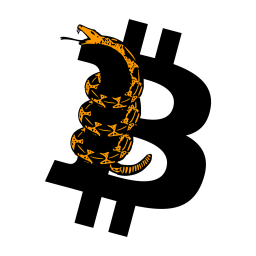
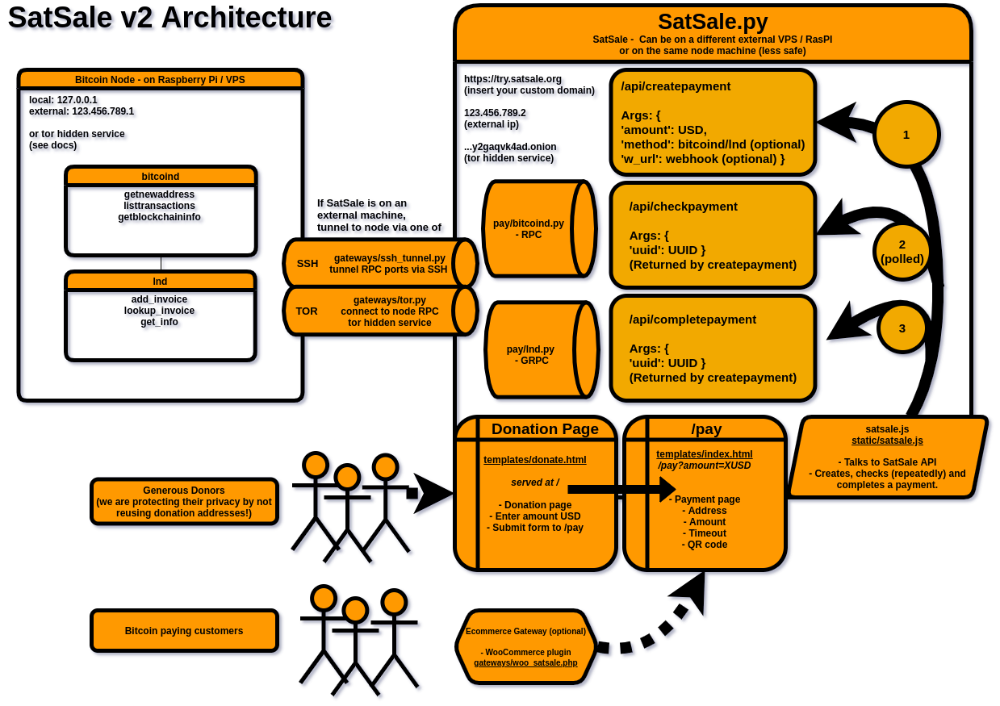

# SatSale
<!---Existing self-custody Bitcoin payment processors are bloated, difficult to install, and not easily customisable.--->
SatSale is a lightweight Bitcoin payment processor that connects to your own Bitcoin node or Lightning network node.

Donation Button     ----->  |  Bitcoin Payment Gateway
:-------------------------:|:-------------------------:
[](https://try.satsale.org/) <br />(Click for donation page demo)<br /> Initiates payment -----> |  [](https://store.btcpyment.com/) <br />(Click for WordPress store payments demo)

- [Purpose](#purpose)
- [Features](#features)
- [Installation (short!)](#installation--short--)
    + [Install](#install)
    + [Connect to your Bitcoin Node](#connect-to-your-bitcoin-node)
    + [Run SatSale](#run-satsale)
    + [Embed a Donation Button](#embed-a-donation-button)
    + [Using HTTPS & Domains](#using-https---domains)
    + [Security](#security)
    + [Payment Gateway (Woocommerce)](#payment-gateway--woocommerce-)
- [Updating](#Updating)
- [Docs](#Docs)
- [Contributions welcomed](#contributions-welcomed)
- [Coming soon](#coming-soon)
- [Disclaimer](#disclaimer)
- [Sponsor](#sponsor)



# Purpose
SatSale currently serves as a
1. Donation page and button for your website that you can easily embed/link to anywhere.
2. Bitcoin payment gateway, including a Woocommerce plugin that easily turns any Wordpress site into a Bitcoin accepting store.
3. Versatile API and payments platform.

Other Bitcoin payment processors are known for being difficult to install and self-host.

SatSale makes donation buttons simple - easy copy paste the one line HTML iframe into your site. With a simple Python backend to talk to your own Bitcoin node, SatSale uses RPC to generate new addresses, and monitors the payment status with your own copy of the blockchain.

Our objective is to share the power of self-custody bitcoin payments with the world.

# Features
* Process payments with your own Bitcoin node via RPC and SSH. Bitcoin core, or any other node software that supports RPC calls.
* Direct peer-to-peer payments without any middleman. No KYC, and greater privacy than donation systems wher Bitcoin addresses are reused multiple times.
* **Lightweight and highly extendable, basic html and css stying. Modular Python backend**, take a [look at the code](satsale.py) or [lnd.py](/pay/lnd.py)!
* Natively extendable to all bitcoind node features (e.g. segwit) through RPC.
* Reusable and extendable [API](https://satsale.org/docs.html).
* No shitcoins. Bitcoin only.


# Installation (short!)
You require a Bitcoin node, if you don't one you should [install one](https://bitcoincore.org/en/download/) preferably on a [Raspberry Pi](https://github.com/kdmukai/raspi4_bitcoin_node_tutorial) / server (VPS). While you can run SatSale on this same machine, a separate VPS is recommended.
### Install
Clone and install dependencies
```
git clone https://github.com/nickfarrow/SatSale
cd SatSale/
pip3 install -r requirements.txt
```
### Connect to your Bitcoin Node
Edit the `config.py` configuration and point to your Bitcoin node:
```python
host = "127.0.0.1"
rpcport = "8332"
username = "RPCUSERNAME"
password = "RPCPASSWORD"
```
(You can find these in `~/.bitcoin/bitcoin.conf`).
When connecting to a remote node, also edit either the SSH `tunnel_host` (or see [tor hidden service](/docs/tor.md)). If you have a lightning node (lnd) and want to use lightning network payments, see [Lightning instructions](docs/lightning.md). More [example configs](docs/).

### Run SatSale
Run SatSale with
```
gunicorn -w 1 -b 0.0.0.0:8000 satsale:app
```
Gunicorn is a lightweight python HTTP server, alternatively you can run with just `python satsale.py` though this is not recommended for production.

That's it! You should now be able to view your SatSale server at `http://YOUR_SERVER_IP:8000/`. If running locally, this will be `127.0.0.1:8000`.

If running on a Raspberry Pi, you will want to [forward port 8000 in your router settings](https://user-images.githubusercontent.com/24557779/105681219-f0f5fd80-5f44-11eb-942d-b574367a161f.png) so that SatSale is also visible at your external IP address. You might have to allow gunicorn through your firewall with `sudo ufw allow 8000`.

You will want to run gunicorn with nohup so it continues serving in the background:
```
nohup gunicorn -w 1 0.0.0.0:8000 satsale:app > log.txt 2>&1 &
tail -f log.txt
```

### Embed a Donation Button
Now embed the donation button into your website HTML:
```html
<iframe src="http://YOUR_SERVER_IP:8000/" style="margin: 0 auto;display:block;width:420px;height:460px;border:none;overflow:hidden;" scrolling="no"></iframe>
```
Changing `YOUR_SERVER_IP` to the IP address of the machine you're running SatSale on, node or otherwise. Additionally, you could redirect a domain to that IP and use that instead.

### Using HTTPS & Domains
Embedded iframes are easy if your site only uses HTTP. But if your site uses HTTPS, then you can see your donation button at `http://YOUR_SERVER_IP:8000/` but will not be able to in an embedded iframe. See [HTTPS instructions](docs/HTTPS.md).

### Security
For maximum security, we recommend hosting on a machine where your node only has access to a **watch-only** wallet.

### Payment Gateway (Woocommerce)
Currently we have a plugin for Woocommerce in Wordpress that makes Bitcoin webstores extremely easy, [please click here for installation instructions](docs/woocommerce.md). SatSale acts as a custom payment gateway for Woocommerce via the php plugin found in `/gateways`. We have plans to extend to other web stores in the future.

# Updating
When updating you want to you keep your config file changes but also receive new config options so it is often easiest to:
```
git stash
git pull origin master
git stash pop
```
You can also just make commits to your modified fork.

# Docs
* Basic [API docs](https://satsale.org/docs.html)
* Example [configs, Tor, HTTPS, nginx, etc](docs/)

# Contributions welcomed
### You only need a little python!
The main code can be found in [satsale.py](satsale.py). The client-side logic for initiating the payment and querying the API sits in [static/satsale.js](static/satsale.js), button appearance in [templates/index.html](templates/index.html), and Woocommerce plugin in [gateways/woo_satsale.php](gateways/woo_satsale.php). Please have ago at implementing some of the things below or in the issues!



# Coming soon
* **Better UI** with more variety of size and theme.
    * Currency toggle between BTC/USD on donation html.
* Late payment recourse.
* More readily customisable donation button (text/color/QR code)
* Different price feeds with various currencies

# Disclaimer
SatSale is in early development. As such, we are not responsible for any loss of funds, vulnerabilities with software, or any other grievances which may arise. Always confirm large payments manually and use cold storage as much as possible.

# Support
Please consider [supporting me](https://btcpyment.nickfarrow.com) via my own instance of SatSale :). This is my first FOSS project, any support would greatly assist my ability to prioritize SatSale and other areas of Bitcoin. And most importantly, **help us bring non-custodial bitcoin payments to the world**. Please email `baseddepartment@nickfarrow.com`.
